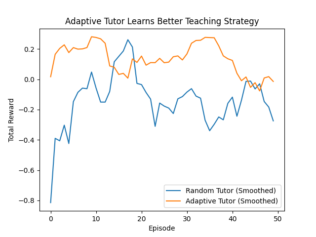
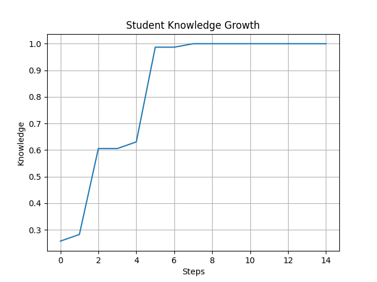

# 🧠 Adaptive Tutor Environment (OpenEnv + RL)

> 🚀 An AI tutor that **learns how to teach** using reinforcement learning
> 📈 Achieves **~2x improvement over random teaching strategies**

---

## 🚨 Problem

Current LLM tutors fail at **adaptive teaching**.

They:

* Over-explain to experts
* Under-explain to beginners
* Do not adapt based on feedback

Teaching is inherently **interactive and dynamic**, but most AI systems are static.

---

## 💡 Our Solution

We built an **OpenEnv-based reinforcement learning environment** where an AI learns how to teach effectively.

* A Tutor agent interacts with a simulated Student
* The Student has hidden internal state (knowledge, confusion, learning rate)
* The Tutor must infer student understanding through interaction
* Learning is driven by a **reward function**

👉 Instead of hardcoding teaching logic, the agent **learns optimal strategies through feedback**

---

## 🎯 Hackathon Theme Alignment

* ✅ **Long-Horizon Planning** → multi-step teaching interactions
* ✅ **World Modeling** → hidden student state inference
* ✅ **Self-Improving Systems** → reward-driven adaptation

---

## 🧩 Environment Design

### 🔹 Hidden Student State

* Knowledge (0–1)
* Confusion
* Learning rate

### 🔹 Observable State (Agent sees)

* Last quiz result
* Interaction history
* Current turn

👉 The agent must **infer student understanding indirectly**

---

## 🎮 Action Space

| Action  | Description        |
| ------- | ------------------ |
| EXPLAIN | Teach concept      |
| QUIZ    | Test understanding |
| HINT    | Provide guidance   |

---

## 🏆 Reward Function

Multi-objective reward:

* 📈 Knowledge gain
* ⏱ Efficiency (fewer steps)
* 🧠 Quiz improvement
* 🔄 Adaptation bonus
* 🚫 Repetition penalty

👉 Encourages **effective and adaptive teaching strategies**

---

## 🤖 Training Approach

### 🔹 Reinforcement Learning (Custom Loop)

* Agent interacts with environment (`reset → step → reward`)
* Policy updated using reward signal:

  ```
  loss * (-reward)
  ```
* Enables learning of **teaching strategy over time**

---

### ⚡ Unsloth Fine-Tuning

We used **Unsloth** for efficient LLM training:

* Model: Mistral 7B (4-bit)
* LoRA fine-tuning (only 0.19% parameters trained)
* Training loss reduced:

  ```
  2.28 → 0.13
  ```

👉 Enables fast and memory-efficient model adaptation

---

## 📊 Results

### 🔹 Training Reward Curve



### 🔹 Knowledge Growth




---

### 🚀 Key Result

| Agent   | Avg Reward |
| ------- | ---------- |
| Random  | 0.025      |
| Trained | 0.052      |

👉 **~2x improvement over baseline**, demonstrating learned teaching behavior

---

## 🚀 Live Demo

🔗 Hugging Face Space:
https://huggingface.co/spaces/SurajBadiger/adaptive-tutor-env

---

## 🤖 Trained Model

🔗 Hugging Face Model:
https://huggingface.co/SurajBadiger/adaptive-tutor-model

---

## 🧪 Training Notebook

🔗 Colab:
https://colab.research.google.com/drive/1wVb7GryF0O549ni1cAnOEfjfjzrncYCE?usp=sharing 

---

📝 Blog (Detailed Writeup)

🔗 https://github.com/surajbadiger5748-afk/adaptive-tutor-env/blob/main/blog.md

👉 Contains:

Full training process
RL explanation
Model details
Results & evaluation

## ⚙️ Tech Stack

* FastAPI (Environment API)
* OpenEnv-style architecture
* Hugging Face Spaces (deployment)
* Hugging Face Transformers
* Unsloth (LLM fine-tuning)
* Python (simulation + RL loop)
* Matplotlib (evaluation)

---

## 💡 Why This Matters

* Moves beyond static tutoring → **adaptive learning systems**
* Applies RL to **real-world education problem**
* Demonstrates **decision-making under uncertainty**
* Shows how AI can **learn strategies, not just generate answers**

---

## 📦 Submission Links

* 🔗 Hugging Face Space:
  https://huggingface.co/spaces/SurajBadiger/adaptive-tutor-env

* 🔗 Hugging Face Model:
  https://huggingface.co/SurajBadiger/adaptive-tutor-model

* 🔗 Colab Notebook:
  https://colab.research.google.com/drive/1wVb7GryF0O549ni1cAnOEfjfjzrncYCE?usp=sharing 

* 🔗 GitHub Repository:
  https://github.com/surajbadiger5748-afk/adaptive-tutor-env 


---

## ⚠️ Notes for Reviewers

* Follows **OpenEnv principles** (`reset`, `step`, `state`)
* Fully deployed via Hugging Face Space
* Demonstrates **reward-driven learning loop**
* Combines **RL + LLM fine-tuning**
* Designed for **realistic adaptive tutoring scenarios**


## ⭐ If you like this project, give it a star!
